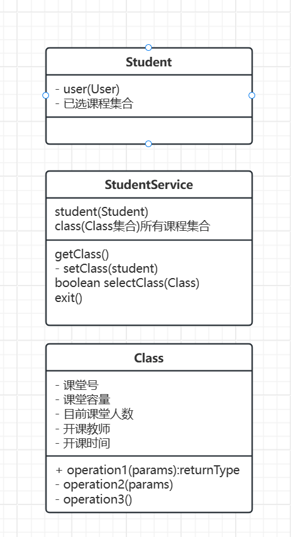

选课分析

***问题是课程的所有信息除了下面的还需要添加什么***

前端创建StudentService对象后（假如为ssvc）

调用ssvc.getClass()

返回包含所有课程信息的集合

点击进去

点击选课调用ssvc.selectClass(Class)，返回true/false

后端需求

一个函数获得所有当前开课的信息（返回课程集合）

一个函数更新数据库中课程相关的信息
