## 《程序设计进阶》作业报告

[TOC]

项目名称：教务系统

团队成员：张义，陈润隆，李存淳，崔闰麟（按入组时间顺序）

协作分工：

- 张义：负责协调团队工作，规划项目结构和规范，数据库的构建以及从教务处获取原始数据
- 陈润隆：负责前端和后端的粘合，后期负责后端的直接开发
- 李存淳：负责前端的课表功能的开发以及功能的调试
- 崔闰麟：负责前端的主力开发，环境构建和github协作顾问

PS：

​	请保证您运行时的JDK版本在8以上

​	在运行程序前，请先做如下配置

 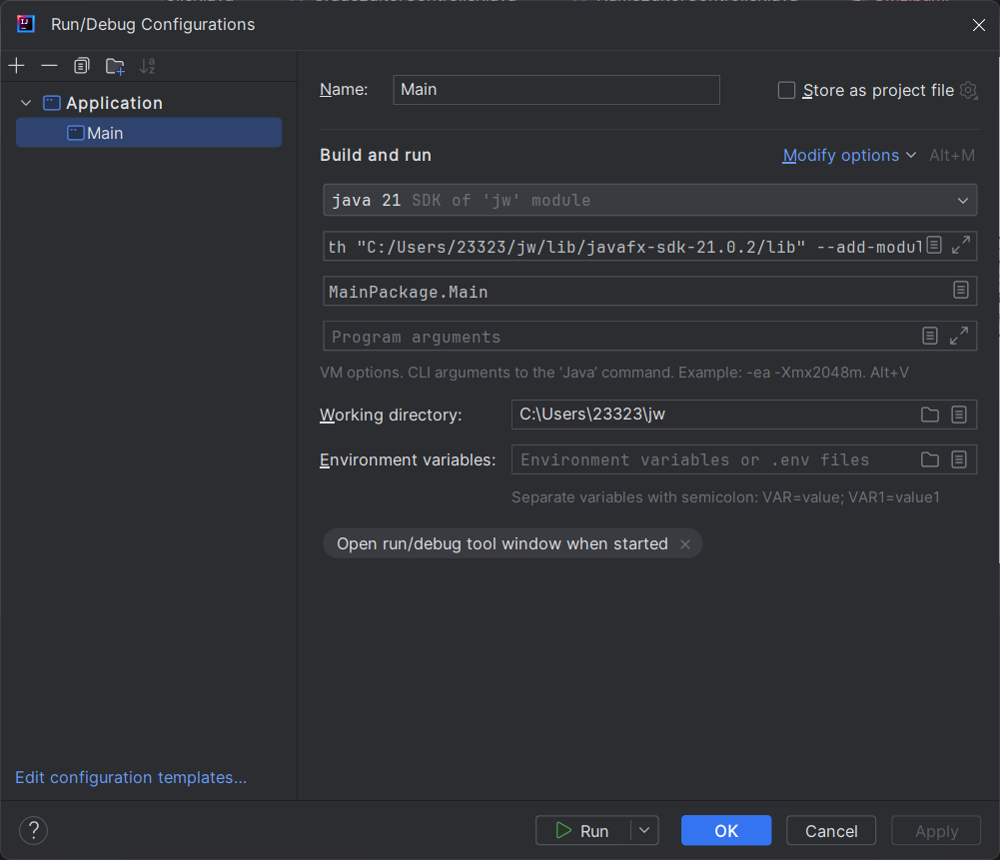

​	其中VM options选项请配置为

```
--module-path "$PROJECT_DIR$/lib/javafx-sdk-21.0.2/lib" --add-modules=javafx.controls,javafx.fxml,javafx.base,javafx.graphics,javafx.media,javafx.swing,javafx.web
```

​	若老师和助教在遇到任何项目上的问题，请第一时间联系我们！我们将做出相应的解答

### 一、项目简介

​	本项目是一个基于Java的教务系统应用，使用了javafx作为前端界面框架，sqlite作为后端数据库。该系统的目的是为了提供一个更加便捷、直观的教务管理平台，方便学生、教师和管理员对课程、成绩等信息的查询和管理。

​	项目目录简介：

- lib：库

- report：报告文档及相关
- src：源文件
- target：输出目录

### 二、技术选型

1. 前端：javafx
   javafx是一个用于构建富客户端应用的开源框架，提供了丰富的UI组件和良好的用户交互体验。我们选择javafx作为前端技术，是因为它能够帮助我们快速搭建出美观、易用的界面。

2. 后端：sqlite
   sqlite是一个轻量级的数据库，不需要配置服务器即可运行，适合本地小型应用使用。我们选择sqlite作为后端数据库，是因为它简单易用，且能够满足我们对数据存储和查询的需求以及多进程访问的冲突解决。

3. 协作：github

   github是目前主流的开源代码托管平台，有着成熟稳健的代码管理体系，支持git的所有版本控制。

### 三、需求分析

#### 1. 项目背景
本项目旨在开发一个综合性的教务系统Application，通过界面化操作，服务于学生选课、教师教学活动和课程管理等需求。

#### 2. 目标用户

- 学生：需要注册、选课、查询课程和成绩、充值学费等功能。
- 教师：需要注册、查看学生名单、修改学生成绩等功能。
- 管理员：需要注册、管理选课和给分权限、管理课程信息、审批注册申请等功能。

#### 3. 业务需求
​	系统需支持学生、教师和管理员三类用户的基本业务流程，包括注册、选课、成绩管理、课程管理等。

#### 4. 功能需求

- ##### 4.1 学生模块
  - 注册功能：学生可以注册账户，注册后需满足特定条件才能成功。

  - 课程查询：查看下学期的课程列表。

  - 选课帮助：根据条件帮助学生选修课程，确保课程不重复、时间不冲突、人数未满。

  - 课程查询：按学分和课程性质等条件查询下学期课程。

  - 成绩查询：在老师给分并经管理员审核后，查询课程成绩。

  - 学费缴纳：完成学费的在线充值。

  - 取消选课：在正式上课前取消已选课程。


- ##### 4.2 教师模块
  - 注册功能：教师注册账户和开设课程，需要得到管理员监管。

  - 查看名单：查看所授课程的选课学生名单。

  - 成绩修改：查看并修改学生成绩。


- ##### 4.3 管理员模块
  - 信息管理：对学生和老师的部分信息做出修改

  - 课程管理：录入或删除课程信息。

  - （注册审批）：审核教师和管理员的注册申请。


- ##### 4.4 数据库模块
  - 数据操作：为教务系统客户端提供即时的数据操作和支持。


- ##### 4.5 GUI模块
  - 登陆界面：设计满足学生、教师、管理员三类用户身份验证的登陆界面。

  - 注册和交互界面：根据三种身份设计相应的注册和操作界面，满足上述功能需求。


#### 5. 非功能需求
- 性能需求：系统应保证高并发下的稳定性和响应速度。
- 可用性需求：界面友好，易于操作，适合不同技术水平的用户。

#### 6. 用户界面需求
- 设计直观的用户界面，确保用户能够轻松地完成注册、登录、选课等操作。
- 提供清晰的指导和反馈信息，帮助用户理解操作结果。

#### 7. 数据需求
- 明确数据的输入输出格式、存储结构和数据库设计。

#### 8. 假设和依赖
- 项目成功依赖于用户积极参与反馈和系统测试。
- 假设所有用户都能够安装Java环境并设置好javafx的相关配置。

#### 9. 验收标准
- 能够完全符合大作业要求

### 四、功能模块

> 用户信息方面

- 注册三种用户

- 用户查询并更改自身信息

- 管理员更改全部人员信息

- 管理员查询用户，附带查找功能

> 课程方面

- 学生与管理员可以查询课程，附带查找功能

- 学生可以选课/退课、查看已选课程、查看课表，查看给分

- 教师可以开课，查看开课，查看课表及选课人员并给分

- 管理员可以删除课程或新增课程

### 五、数据来源

​	为了保证数据的真实性和时效性，我们的原始数据是通过爬虫程序从真实的教务处网站爬取并转换存储到db文件。可以定期运行爬虫程序，保证数据的更新。我们对数据进行了处理，对总课程表项中的缺失项和特殊项进行了处理或删除，并删除了一些非必要信息

​	从教务处网站爬取数据 [spider.py](../src/Extern/spider.py)

​	将下载好的page.html转化为数据库文件 [re_tool.py](../src/Extern/re_tool.py)

​	对于数据库非法数据则使用数据库可视化软件SQLiteStudio批量查询更改

### 六、系统实现

#### GUI

GUI由于内容冗长繁杂，不做过多展示，项目结构及其用途如下：

```
src/
├── GUI/(GUI部分文件)
│   ├── Controller/(控制器，负责处理页面的逻辑，与页面一一对应)
│   │   ├── Components/(GUI组件，全局可用的组件)
│   │   │   ├── Time/(时间组件)
│   │   │   │   └── TimeTableController(时间选择器页面)
│   │   │   └── UserInformationEditor/(用户信息编辑器)
│   │   │       ├── GradeEditorController(年级编译器，覆盖式编辑)
│   │   │       ├── MoneyEditorController(账户金额编译器，覆盖式编译)
│   │   │       ├── NameEditorController(姓名编译器，覆盖式编译)
│   │   │       ├── PasswordChangerController(密码更改器，需原密码)
│   │   │       ├── PasswordEditorController(密码编译器，不需要原密码)
│   │   │       ├── RechargerController(充值界面，增加式更改)
│   │   │       ├── StudentSchoolEditorController(学生院系编辑器，覆盖式编辑)
│   │   │       └── TeacherSchoolEditorController(教师院系编辑器，覆盖式编辑)
│   │   ├── Login/(登录相关的界面)
│   │   │   ├── IDPageController(注册后的ID展示页面)
│   │   │   ├── LoginController(登录页面)
│   │   │   └── RegistController(注册页面)
│   │   └── Main/(主要的界面)
│   │       ├── Admin/(管理员相关)
│   │       │   ├── AdminMainMenuController(管理员的主菜单页面)
│   │       │   └── ManageUserPageController(管理员管理用户的页面)
│   │       ├── Common/(通用的页面)
│   │       │   ├── Classes/(课程相关的通用页面)
│   │       │   │   ├── ClassesChoosingPageController(课程选择页面，包括全部课程任何页面)
│   │       │   │   ├── ClassesMainPageController(课程主页)
│   │       │   │   ├── ClassesSchedulePageController(课表页面)
│   │       │   │   └── ProposeCoursePageController(新建课程页面)
│   │       │   ├── MainMenuController(主页面，学生/教师/管理员的主页的公共部分)
│   │       │   └── UserInformationPageController(用户自身信息页面的公共部分)
│   │       ├── Student/(学生相关)
│   │       │   ├── Classes/(学生的课程相关页面)
│   │       │   │   ├── DropClassesPageController(学生查看已选课程的页面)
│   │       │   │   └── StudentScoreController(学生查看课程分数的页面)
│   │       │   ├── StudentInformationController(学生自身信息页面，仅包含学生专有部分)
│   │       │   └── StudentMainMenuController(学生的主菜单页面)
│   │       └── Teacher/(教师相关)
│   │           ├── Classes/(教师的课程相关页面)
│   │           │   ├── TeacherScoreMainPageController(教师教授课程页面)
│   │           │   └── TeacherScoreSubPageController(教师课程给分页面)
│   │           ├── TeacherInformationController(教师自身信息页面，仅包含教师专有部分)
│   │           └── TeacherMainMenuController(教师的主菜单页面)
│   ├── Data/(数据相关)
│   │   ├── DataPackage/(数据包)
│   │   │   ├── Classes/(课程相关的数据包)
│   │   │   │   ├── Classes(课程信息数据包)
│   │   │   │   ├── ClassesForTable(给表格提供的课程信息数据包)
│   │   │   │   ├── ClassesSet(课程信息集合数据包)
│   │   │   │   ├── ClasseCodeSet(课程代码集合数据包)
│   │   │   │   ├── CourseTimeSet(课程时间集合数据包)
│   │   │   │   ├── IDSet(用户ID集合数据包)
│   │   │   │   ├── StudentCourseScoreTable(给学生查询分数表格提供的数据包)
│   │   │   │   ├── TeacherScoreMainTable(给教师课程信息表格提供的数据包)
│   │   │   │   ├── TeacherScoreSubTable(给教师打分页面表格提供的数据包)
│   │   │   │   └── TimeTable(给课表表格提供的数据包)
│   │   │   └── UserInformation/(用户信息相关的数据包)
│   │   │       └── UserInformationForTable(给表格提供的用户信息数据包)
│   │   ├── Enum/(枚举类及其相关)
│   │   │   ├── Classes/(课程相关)
│   │   │   │   ├── EnumForClassesSearching/(旧版数据包TODO)
│   │   │   │   ├── Campus(校区枚举类)
│   │   │   │   ├── ClassType(课堂类型枚举类)
│   │   │   │   ├── CourseTime(课程时间枚举类)
│   │   │   │   ├── CourseType(课程类型枚举类)
│   │   │   │   ├── Education(课程教育阶段枚举类)
│   │   │   │   ├── ExamMode(考试方式枚举类)
│   │   │   │   ├── Full(课程是否已满枚举类)
│   │   │   │   ├── Language(课程语言枚举类)
│   │   │   │   ├── TimeUtil(时间相关工具类，用于课程节次等信息的转换)
│   │   │   │   └── Week(星期枚举类)
│   │   │   ├── Error/(返回类型，或者说错误类型，用于GUI与后端通信)
│   │   │   │   ├── Login/(登录部分对应)
│   │   │   │   │   ├── Login(登录函数的返回值)
│   │   │   │   │   └── Regist(注册函数的返回值)
│   │   │   │   └── Main/(主要部分函数对应)
│   │   │   │       ├── Components/(组件服务部分的函数对应)
│   │   │   │       │   ├── ClassesServ/(课程服务部分的函数对应)
│   │   │   │       │   │   ├── DeleteClassesError(删除课程函数的返回值)
│   │   │   │       │   │   └── NewClassesError(新建课程函数的返回值)
│   │   │   │       │   └── UserServ/(用户信息部分的函数对应)
│   │   │   │       │       ├── ChangePasswordError(更改密码函数的返回值)
│   │   │   │       │       └── EditError(编辑信息函数的返回值，通用)
│   │   │   │       └── Student/(学生相关)
│   │   │   │           └── ClassesServ/(课程服务部分的函数对应)
│   │   │   │               ├── DropClassesError(退课函数的返回值)
│   │   │   │               └── PickClassesError(选课函数的返回值)
│   │   │   ├── GUI/(GUI内部使用为GUI提供服务的数据类型)
│   │   │   │   ├── ObservableList/(GUI中特殊的队列)
│   │   │   │   │   ├── ClassesChoosingObservableList(课程选择页面中的遍历队列)
│   │   │   │   │   ├── ClassesInformationObservableList(课程信息中的遍历队列)
│   │   │   │   │   └── UserObservableList(用户信息的遍历队列)
│   │   │   │   └── Scene/(场景的枚举类型)
│   │   │   │       └── EditUserPage(编译用户信息页面的枚举类)
│   │   │   ├── USer/(用户信息的枚举类)
│   │   │   │   ├── Gender(性别的枚举类)
│   │   │   │   ├── Grade(年级的枚举类)
│   │   │   │   ├── StudentSchool(学生院校的枚举类)
│   │   │   │   └── UserType(用户类型的枚举类)
│   │   │   └── School(院校的枚举类)
│   │   └── Util/(工具类)
│   │       └── Classes/(课程相关)
│   │           └── ObservableListUtil(特殊队列专用的工具类)
│   ├── GUIUtil/(GUI的工具类)
│   │   ├── MainPageUtil(打开主页面的工具类)
│   │   └── StageUtil(页面和场景相关的工具类)
│   ├── Resources/(资源)
│   └── Window/(页面布局，与Controller一一对应)
└── MainPackage/(入口)
    └── Main(入口类，也是JavaFX，Application的主类)
```

#### Database

##### 目录文件

```
+---Data/(负责放置和数据库相关的文件)
|   |   SQLiteJDBC.java
|   |   SQLiteJDBC.md
|   |   test.db
|   |
|   +---Tables/(放置和六个表相关操作的类)
|   |       CodeStudent.java
|   |       CodeTeacher.java
|   |       Courses.java
|   |       Managers.java
|   |       Students.java
|   |       Tables.java
|   |       Teachers.java
|   |
|   \---Utils/(放置辅助处理信息的类)
|           CodeUtil.java
|           DaysUtil.java
|           IDUtil.java
|           NameUtil.java
|           PasswordUtil.java
|           PointUtil.java
|           TimeUtil.java
|           UserTypeTransformer.java
|           UserUtil.java
|(以下由前端提供各式,后端负责功能实现)
+---Login/(和登录相关)
|       LoginServ.java
|       RegisterServ.java
|
\---Main/(和GUI对应,通过对表的操作和Utils来实现所需功能)
    +---Components
    |   +---ClassServ
    |   |       ClassesSearchingServ.java
    |   |       ClassesServ.java
    |   |       ClassesServDocument.md
    |   |
    |   \---UserServ
    |           UserServ.java
    |           UserServDocument.md
    |
    +---Student
    |   \---ClassesServ
    |           StudentClassesServ.java
    |           StudentClassesServDocument.md
    |
    \---Teacher
        \---ClassesServ
                TeacherClassesServ.java
                TeacherClassesServDocument.md
```

##### 数据库封装

在SQLiteJDBC.java中完成对数据库sqlite一些常用操作的封装(对表操作)：连接，关闭，执行(一些非查询操作)等

一些私有属性

    private String tableName;
    //表名,用来指明操作的表
    private String databasePath;
    //数据库路径
    private Connection c;
    //用于连接数据库
    private Statement stmt;
    //用于执行操作
    private ResultSet rs;
    //用于查看查询结果
    private String sql;
    //执行语句

接下来的函数就是通过修改`sql`来实现不同的操作，包括：建表，增删查改。查询中根据需要：包含匹配查询，无条件查询，多条件查询，查询多项，查询单项，值存在查询，根据sqlite的语法在java中实现，具体实现请见SQLiteJDBC.java详细代码

###### 原版数据库

由张义从教务处官网获得并作初步处理

###### 数据库

在`./Data/Tables/`下

（测试文件中的账号资料较多，若测试用请查看附件，为了便于检查，默认数据库为test.db）

###### 原版数据库处理

Tables.java

    public static void main(String[] args) {
        Tables tables = new Tables();
        tables.createTables();
        tables.initTeachersTable();
        tables.initCoursesTable();
    
        tables.addManager();
        tables.addStudent(100);
    }

包括建表，初始化老师，初始化课程信息，初始化codeTeacher表

初始化课程信息时去除了无固定上课时间，有值为null的课程

- 四个储存信息的表

1. studentsTable结构

    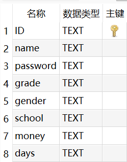

2. teachersTable结构

    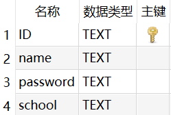

3. managersTable结构

    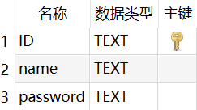

4. coursesTable结构

    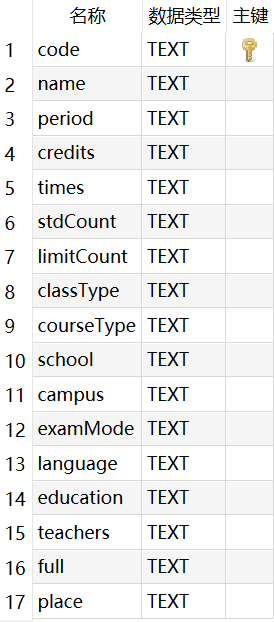

​	对应的类提供构造方法，包含所有的属性信息，所有（除ID）的set方法，以及一些方便查询，增加的静态方法（以Students.java为例，其他三个表的java文件类似）

- 和数据库相关的属性，用于连接数据库


    public static final String tableName = Tables.STUDENTS;
    public static final String[] StudentCol=Tables.StudentCol;
    public static final String PRIMARY_KEY = "ID";
    private static final SQLiteJDBC studentsTable = new SQLiteJDBC(tableName);

- 信息属性，负责创建后便于使用


    public boolean IDExist;
    private String ID;
    public String name;
    public String password;
    
    public String grade;
    public String gender;
    public String school;
    public String money;
    
    public String days;
    public String[] codes;

- 带参构造，对上述属性初始化,若IDExist为否，其他属性无效


    public Students(String ID) {
        this.ID = ID;
        IDExist = isIDExist();
        if(!IDExist)
            return;
        String[] info = getInfo();
        name = info[1];
        password = info[2];
        grade = info[3];
        gender = info[4];
        school = info[5];
        money = info[6];
        days = info[7];
        codes = CodeStudent.getCoursesCode(ID);
    }

- 对应的set方法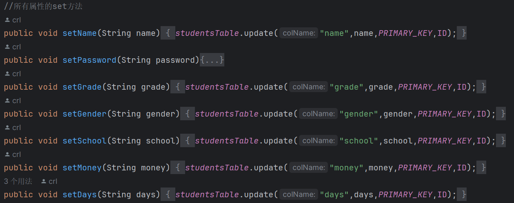


- 一些辅助的静态方法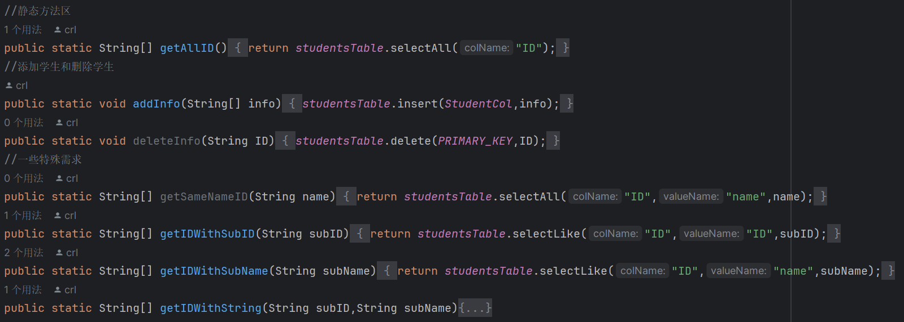


- 两个和课程信息相关的表，变化较为频繁，提供静态的查询修改方法

1. codeTeacherTable表结构

    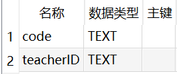

2. codeStudentTable表结构

    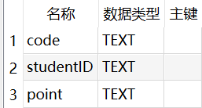

这两个表实时变化codeTeacher根据开课,删课而变化,存储课程编号和老师ID,无主键

- codeStudent根据学生选课而初始化,退课删除数据,老师给分也是修改该表中的数据

##### Utils

​	包含对各种属性的相应处理

### 七、测试记录

​	此表为较为细节的测试结果，其他测试结果详情请查看[实机演示](videos/实机演示.mp4)

- 满课选课测试

  

  选课后的课表（原始为空）

  

- 未给分成绩测试

  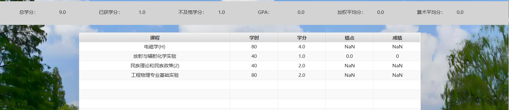

- 教师给分非法（字母或负号）

  

  无法录入，且被限制在0~100

- 课程开课非法输入

   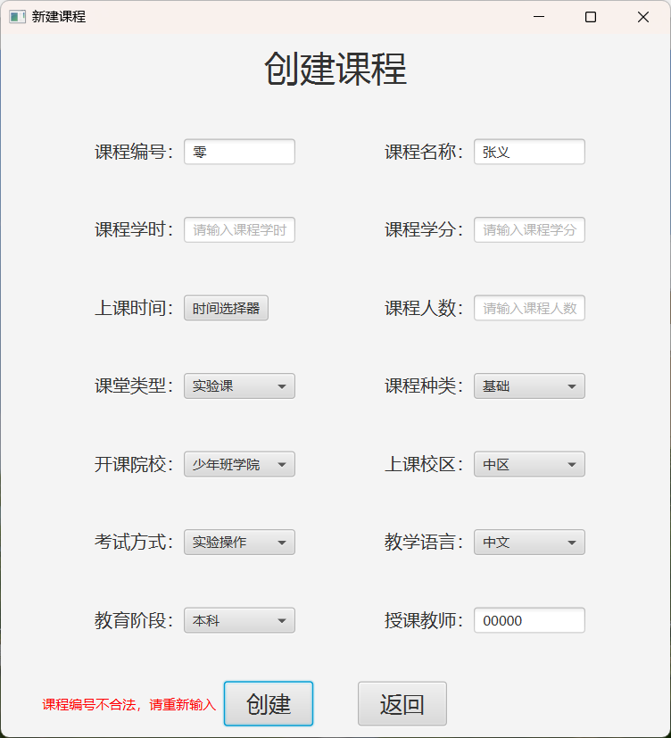

### 八、项目总结

​	通过本次项目，我们团队成员不仅提升了Java编程能力，也学习到了如何使用javafx和sqlite等技术。同时，我们也体会到了团队协作的重要性，熟练掌握了github等协作工具的使用，每个成员都在项目中承担了不同的责任，相互沟通，相互配合，共同完成了这个教务系统应用。

### 九、遇到的困难

1. 从教务处获取的数据有缺陷，如存在null值，上课时间及地点等需提取（解决方案：通过python脚本查询空项并删除、使用正则表达式提取）
2. 多人合作过程中，由于专注的领域不同，导致项目出现bug时无法及时解决，加之课业时间紧张。我们通过定期2周开设小组例会，共同探讨问题，并集中利用时间高效解决
3. javafx架构的复杂性使得项目管理变得困难，我们的队员通过寻找插件等方式图形化编程，使得代码效率大大提高
4. 代码堆砌带来的冗杂会使开发者出现厌烦情绪，我们通过规范开发文档，代码重构迭代等方式进行缓解
5. 由于前期项目构建时没有考虑后期的打包，导致程序脱离编译器较为困难

### 十、未来展望

​	未来我们计划继续完善这个教务系统，增加更多实用的功能，如课表自动排课、考试安排提醒等。同时，我们也希望能够有朝一日，这个系统能够成为一个成熟的产品推广到其他学校中（USTCer太卷了），帮助更多的师生解决教务管理的问题。

### 十一、附件

- 项目历程及贡献度

 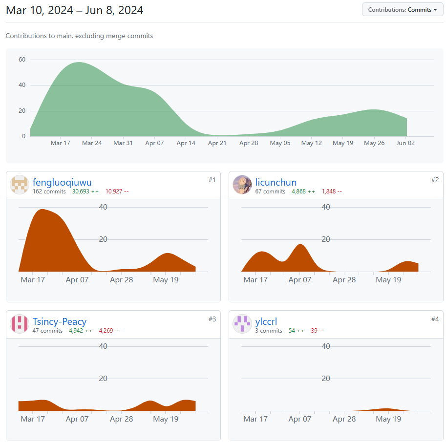

说明：

1. `#1fengluoqiuwu`为崔闰麟，`#2licunchun`为李存淳，`#3Tsincy-Peacy`为张义，`#4ylccrl`为陈润隆
2. 由于崔闰麟与陈润隆在github网页端识别出现问题，导致陈润隆的改动需要以崔闰麟的身份提交，故出现此极端现象

- 运行视频

​	请查看[实机演示](videos/实机演示.mp4)

- 账号密码（更多请使用数据库可视化软件查询jw/src/Service/Data/Utils/[test.db](../src/Service/Data/test.db)）

  - 管理员

     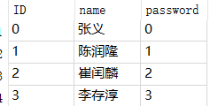

  - 学生

     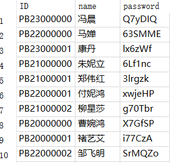

  - 老师

     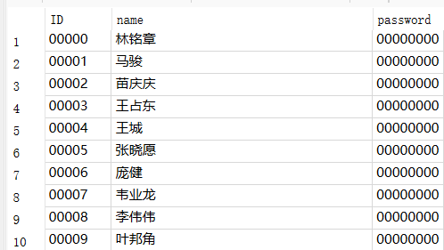