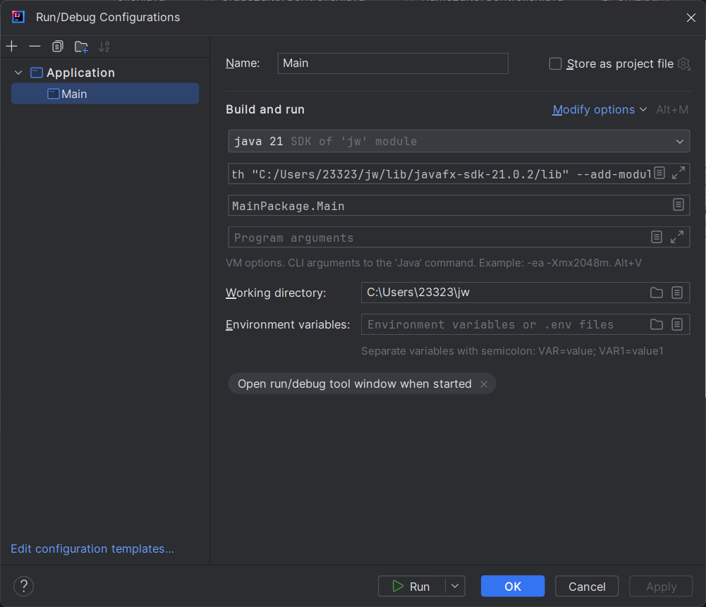
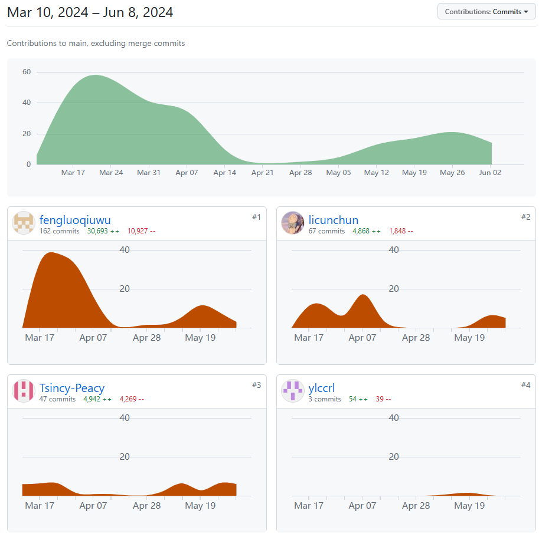

## 《程序设计进阶》作业报告

项目名称：教务系统

团队成员：张义，陈润隆，李存淳，崔闰麟（按入组时间顺序）

协作分工：

- 张义：负责协调团队工作，规划项目结构和规范，数据库的构建以及从教务处获取原始数据
- 陈润隆：负责前端和后端的粘合，后期负责后端的直接开发
- 李存淳：负责前端的课表功能的开发以及功能的调试
- 崔闰麟：负责前端的主力开发，环境构建和github协作顾问

PS：

​	请保证您运行时的JDK版本在8以上

​	在运行程序前，请先做如下配置

 

​	其中VM options选项请配置为

```
--module-path "$PROJECT_DIR$/lib/javafx-sdk-21.0.2/lib" --add-modules=javafx.controls,javafx.fxml,javafx.base,javafx.graphics,javafx.media,javafx.swing,javafx.web
```

### 一、项目简介

​	本项目是一个基于Java的教务系统应用，使用了javafx作为前端界面框架，sqlite作为后端数据库。该系统的目的是为了提供一个更加便捷、直观的教务管理平台，方便学生、教师和管理员对课程、成绩等信息的查询和管理。

### 二、技术选型

1. 前端：javafx
   javafx是一个用于构建富客户端应用的开源框架，提供了丰富的UI组件和良好的用户交互体验。我们选择javafx作为前端技术，是因为它能够帮助我们快速搭建出美观、易用的界面。

2. 后端：sqlite
   sqlite是一个轻量级的数据库，不需要配置服务器即可运行，适合本地小型应用使用。我们选择sqlite作为后端数据库，是因为它简单易用，且能够满足我们对数据存储和查询的需求以及多进程访问的冲突解决。

3. 协作：github

   github是目前主流的开源代码托管平台，有着成熟稳健的代码管理体系，支持git的所有版本控制。

### 三、需求分析

// **TODO**

张义

### 四、功能模块

// **TODO**

思路：遍历运行时GUI，记录并整理

李存淳


### 五、数据来源

// **TODO**：添加python脚本

​	为了保证数据的真实性和时效性，我们的原始数据是通过爬虫程序从真实的教务处网站爬取并存储到db文件。可以定期运行爬虫程序，保证数据的更新。我们对数据进行了处理，对总课程表项中的缺失项和特殊项进行了处理或删除，并删除了一些非必要信息

### 六、系统实现（GUI+Database）

// **TODO**

思路：GUI和Service分管，只需阐述文件组织结构即调用关系即可，详细类结构附加在UML. pdf中

崔闰麟，陈润隆

#### GUI


#### Database


### 七、测试记录

// **TODO**

陈润隆

### 八、项目总结

​	通过本次项目，我们团队成员不仅提升了Java编程能力，也学习到了如何使用javafx和sqlite等技术。同时，我们也体会到了团队协作的重要性，熟练掌握了github等协作工具的使用，每个成员都在项目中承担了不同的责任，相互沟通，相互配合，共同完成了这个教务系统应用。

### 九、遇到的困难

// **TODO**

// 思路：慢慢想，想起啥是啥

// ALL

1. 从教务处获取的数据有缺陷，如存在null值，上课时间及地点等需提取（解决方案：通过python脚本查询空项并删除、使用正则表达式提取）
2. 多人合作过程中，由于专注的领域不同，导致项目出现bug时无法及时解决，加之课业时间紧张。我们通过定期2周开设小组例会，共同探讨问题，并集中利用时间高效解决
3. javafx架构的复杂性使得项目管理变得困难，我们的队员通过寻找插件等方式图形化编程，使得代码效率大大提高
4. 代码堆砌带来的冗杂会使开发者出现厌烦情绪，我们通过规范开发文档，代码重构迭代等方式进行缓解

### 十、未来展望

​	未来我们计划继续完善这个教务系统，增加更多实用的功能，如课表自动排课、考试安排提醒等。同时，我们也希望能够有朝一日，这个系统能够成为一个成熟的产品推广到其他学校中（USTCer太卷了），帮助更多的师生解决教务管理的问题。

### 十一、附件

- 项目历程及贡献度



说明：

1. `#1fengluoqiuwu`为崔闰麟，`#2licunchun`为李存淳，`#3Tsincy-Peacy`为张义，`#4ylccrl`为陈润隆
2. 由于崔闰麟与陈润隆在github网页端识别出现问题，导致陈润隆的改动需要以崔闰麟的身份提交，故出现此极端现象

- 运行截图 // **TODO** 李存淳